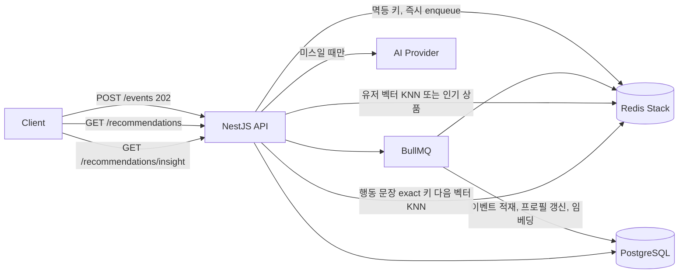

# pick-flow

B2C 쇼핑몰의 클릭·좋아요를 실시간 취향으로 바꾸고, 비슷한 행동 해석에는 LLM을 다시 호출하지 않는 추천 API입니다.

유저가 상품을 누르면 API는 그 사실을 기록만 하고 바로 응답합니다. 취향 벡터 갱신과 상품 임베딩은 BullMQ 워커가 뒤에서 처리합니다. 추천 목록은 좌표 비교로 고르고, 응답에 최근 행동이 어떤 쇼핑인지를 함께 넣습니다. 비슷한 행동이면 그 문장을 재사용해 생성 비용이 0입니다. 상품 좌표와 인기 점수는 Redis에 14일만 둡니다. 인기 점수는 날짜별로 쌓이고, 하루 목록은 상위 1만 개만 남습니다. 좌표 원본은 PostgreSQL에 남습니다. 로컬과 부하 테스트는 Fake AI Provider로 돌리므로 외부 API 비용도 0입니다.

## 기술 스택


| 영역              | 선택                                                                          |
| --------------- | --------------------------------------------------------------------------- |
| API             | NestJS 11, TypeScript                                                       |
| 원장              | PostgreSQL 16, TypeORM migration                                            |
| 서빙 인덱스 / 캐시 / 락 | Redis Stack (RediSearch HNSW)                                               |
| 비동기 파이프라인       | BullMQ                                                                      |
| 인증              | JWT, Passport                                                               |
| AI              | `AI_PROVIDER=fake` 또는 `gemini` (`gemini-3.6-flash`, `gemini-embedding-001`) |


일반 `redis` 이미지는 `FT.SEARCH`가 없습니다. 반드시 Redis Stack을 씁니다.

## 요청이 갈라지는 지점



추천 목록과 행동 해석 캐시는 일부러 분리했습니다. 추천 상품은 사람마다 달라야 하고, 시맨틱 캐시는 행동의 뜻이 같으면 어떤 쇼핑인지에 대한 답을 다시 써야 합니다. 추천 결과 자체를 그 캐시에 넣으면 다른 사람의 상품 목록이 섞입니다.

## 로컬 실행

Docker로 Postgres와 Redis Stack을 띄웁니다.

```bash
docker compose up -d
copy .env.example .env
npm install
npm run start:dev
```

다른 터미널에서 시드. 시드 프로세스가 임베딩 워커를 같이 띄우므로, API 서버가 떠 있지 않아도 됩니다.

```bash
npm run build
npm run seed
```

시드 계정은 로컬 데모용입니다.


| 역할    | 이메일                                             | 비밀번호       |
| ----- | ----------------------------------------------- | ---------- |
| 일반 유저 | [demo@pickflow.dev](mailto:demo@pickflow.dev)   | Demo1234!  |
| 관리자   | [admin@pickflow.dev](mailto:admin@pickflow.dev) | Admin1234! |


Swagger는 개발 모드에서 [http://localhost:3000/docs](http://localhost:3000/docs) 입니다. Authorize에 로그인 토큰을 넣으면 새로고침 후에도 유지됩니다. Bull Board는 [http://localhost:3000/admin/queues](http://localhost:3000/admin/queues) 에서 `user-events`, `profile-refresh`, `product-embedding` 큐를 봅니다. 둘 다 production에서는 열리지 않습니다. 성공 응답은 인터셉터가 `{ success, data, requestId, timestamp }`로 감쌉니다.

## 데모 순서

```bash
# 1. 로그인
curl -s http://localhost:3000/api/v1/auth/login ^
  -H "Content-Type: application/json" ^
  -d "{\"email\":\"demo@pickflow.dev\",\"password\":\"Demo1234!\"}"

# 2. 상품 목록에서 id 하나를 고른 뒤 클릭 이벤트. 바디의 duplicate 가 false 이고 HTTP 는 202.
curl -s -D - http://localhost:3000/api/v1/events ^
  -H "Authorization: Bearer TOKEN" ^
  -H "Content-Type: application/json" ^
  -d "{\"productId\":\"PRODUCT_ID\",\"type\":\"LIKE\",\"clientEventId\":\"like-demo-0001\"}"

# 3. 같은 clientEventId 로 한 번 더. duplicate=true, 큐에는 안 들어간다.
# 4. 5초 안팎 뒤 추천. 임베딩이 끝났으면 source 가 personalized 가 된다.
curl -s "http://localhost:3000/api/v1/recommendations?limit=5" -H "Authorization: Bearer TOKEN"

# 5. 좋아요 뒤에 어떤 쇼핑인지. 행동이 없으면 match=skipped. 처음은 generated, 같은 행동이면 exact 또는 semantic.
curl -s http://localhost:3000/api/v1/recommendations/insight -H "Authorization: Bearer TOKEN"

curl -s http://localhost:3000/api/v1/recommendations/cache/stats -H "Authorization: Bearer TOKEN"
```

`AI_PROVIDER=gemini`로 바꾸면 `GEMINI_API_KEY`가 필수입니다. 채팅 모델은 `gemini-2.5-flash`, 임베딩은 `gemini-embedding-001`이고 차원은 384로 맞춥니다. 공급자나 차원을 바꾼 뒤에는 관리자 토큰으로 `POST /api/v1/products/reindex`와 `POST /api/v1/recommendations/cache/clear`를 호출해야 합니다. 서로 다른 모델의 벡터는 비교할 수 없습니다.

## 부하 테스트

k6는 Fake AI만 칩니다. `npm run start:load`가 `LOAD_TEST=true`와 `AI_PROVIDER=fake`를 프로세스 환경에 넣고, 코드는 이 모드에서 Gemini를 선택하지 않습니다. 같은 플래그가 켜져 있으면 로그인과 쇼핑 해석 횟수 제한도 우회합니다. production에서는 `LOAD_TEST`를 켤 수 없습니다.

이미 `npm run start:dev`가 3000을 쓰고 있으면 먼저 끄고 아래를 실행합니다.

```bash
npm run start:load
```

다른 터미널:

```bash
npm run loadtest
```

시나리오는 세 갈래입니다. 여러 유저가 상품과 행동(조회·클릭·좋아요·장바구니·구매)을 섞어 넣고, 어떤 쇼핑인지 API로 저장된 답 재사용을 셉니다. 관리자 계정은 상품을 조금씩 등록해 임베딩 큐에 작업을 넣습니다. 콘솔에 나오는 로그와 에러 스택은 `logs/pick-flow.log`에도 쌓입니다.

## 테스트

```bash
npm test
npm run lint
npm run build
```

단위 테스트는 Postgres와 Redis 없이 돌아갑니다. 시맨틱 캐시 테스트는 인메모리 벡터 저장소로 KNN, exact 히트, 동시 요청 합류를 검증합니다.

## 운영 이미지

```bash
docker build -t pick-flow .
```

앱 컨테이너는 `DATABASE_URL`, `REDIS_URL`, `JWT_SECRET`을 주입해야 합니다. 기동 시 TypeORM migration이 실행됩니다. `synchronize`는 켜지 않습니다.

## 디렉터리

```text
src/
  main.ts                 부트스트랩, Swagger, Bull Board
  app.module.ts           글로벌 가드, 인터셉터, 필터, 미들웨어
  config/                 환경 변수 검증과 중첩 설정
  common/                 데코레이터, 가드, 인터셉터, 예외 필터
  database/               TypeORM, snake_case, migration
  redis/                  락, 레이트리밋 Lua, 벡터 인덱스
  ai/                     Fake / Gemini 공급자
  semantic-cache/         exact 캐시 + 벡터 캐시 + 스탬피드 락
  queue/                  BullMQ 커넥션과 큐 이름
  auth/ users/            JWT 회원가입, 로그인
  catalog/                상품 원장과 임베딩 워커
  events/                 202 수집 API와 적재 워커
  recommendations/        취향 좌표, 추천 API, 어떤 쇼핑인지
  health/                 Postgres / Redis 프로브
  scripts/                시드
load/k6.js              Fake AI 부하 시나리오
scripts/start-load.js   LOAD_TEST + Fake AI 로 서버 기동
```

